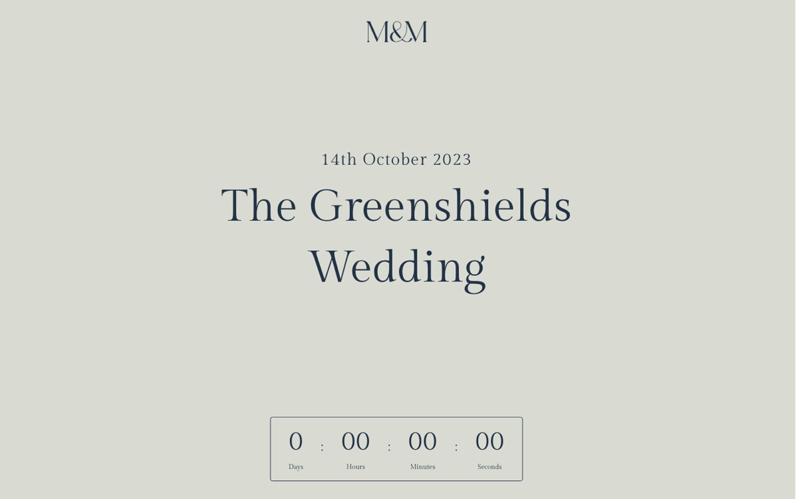
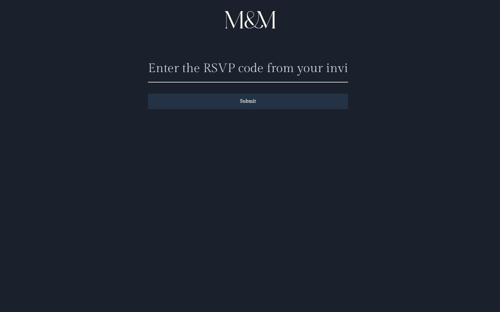
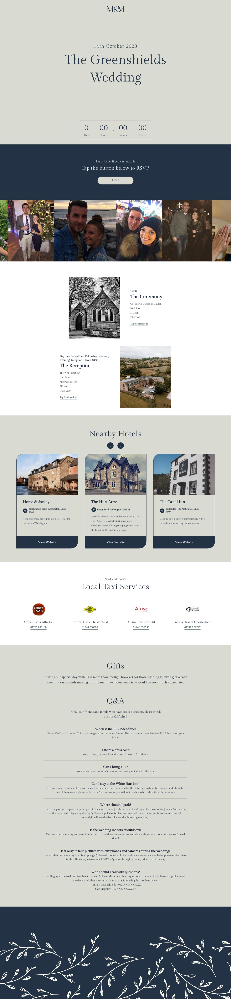

# The Greenshields Wedding Website

A single-page wedding website with a code-gated RSVP flow, designed and built as a freelance commission for a wedding on 14th October 2023. Guests used it in the run-up to the day for venue details, directions, accommodation, local taxis, and RSVPs.

> **Status: archived.** The wedding has been and gone, so the site is no longer deployed. The repo is kept as a portfolio piece and still builds and runs locally.

<p align="center">
  
</p>
<p align="center">
  
</p>

<details>
  <summary><strong>Full landing page screenshot</strong></summary>
  <p align="center">
    
  </p>
</details>

## Features

- **Countdown hero** — live countdown to the ceremony, with loading placeholders while the first tick computes.
- **Code-gated RSVP flow** — each paper invitation carried an invite code. Entering it routes guests to the correct form (day guests vs. evening guests), with a follow-up dietary question that routes day guests to a vegan-menu variant. The whole flow is driven by URL query parameters and React Router, so every state is linkable and the browser back button just works.
- **Embedded RSVP forms** — responses are collected by embedded [AidaForm](https://aidaform.com) forms, so there was no backend to build, host, or secure for a site with a few months of useful life.
- **Photo marquee** — a continuously scrolling strip of engagement photos. Images are WebP, lazy-loaded through `React.Suspense` + [react-image](https://github.com/mbrevda/react-image) with spinner fallbacks, and the marquee pauses when the tab is hidden (Page Visibility API) to avoid wasting cycles.
- **Practical info for guests** — ceremony and reception cards with map links, a nearby-hotels carousel, a local taxi directory with tap-to-call links, and a Q&A section.
- **Scroll-reveal animations** — sections fade and slide in on first view via framer-motion and a small IntersectionObserver hook.
- Fully responsive, with a collapsible mobile nav.

## Tech stack

| | |
|---|---|
| UI | React 18, React Router 6 |
| Styling | styled-components + [twin.macro](https://github.com/ben-rogerson/twin.macro) (Tailwind utility classes composed inside CSS-in-JS), custom Gilda Display webfont |
| Animation | framer-motion, react-fast-marquee, react-slick |
| Build | Create React App (react-scripts 5) |
| Hosting | Netlify (static deploy with SPA redirect rules in [`public/_redirects`](public/_redirects)) |

## Running locally

Requires Node 18+ and Yarn.

```bash
yarn install
yarn start        # dev server on http://localhost:3000
yarn build        # production build to ./build
```

To try the RSVP flow locally, visit `/rsvp` and use the invite codes from [`src/RsvpPage.jsx`](src/RsvpPage.jsx) (`letsgetmarried` for day guests, `timetoparty` for evening guests).

## Design decisions

**No backend, on purpose.** This site had a lifespan of about ten months and a single job: inform guests and collect RSVPs. A static SPA plus an embedded form service meant zero server cost, zero maintenance, and nothing to secure — the right trade for the project, even if it wouldn't be for a product with a longer life.

**Invite codes live client-side.** The codes gate the RSVP forms and shipped in the bundle. That's a deliberate, proportionate choice: the "attacker" is a curious guest, the worst case is an uninvited RSVP that the couple would spot immediately, and the codes became worthless the day of the wedding. Real authentication would have added a backend (and login friction for grandparents) to defend against a threat that didn't matter.

**Performance where it counts.** The heaviest part of the page is the photo marquee, so the photos are compressed WebP, loaded lazily with visible fallbacks, the component is memoized, and animation stops while the tab is hidden.

## Project structure

```
src/
├── App.js                  # Router: / (landing) and /rsvp
├── MainLandingPage.js      # Composes the landing page sections
├── RsvpPage.jsx            # Invite-code gate + form routing via query params
├── components/
│   ├── hero/               # Countdown hero
│   ├── cta/                # RSVP call-to-action banner
│   ├── marquee/            # Lazy-loaded photo marquee
│   ├── features/           # Ceremony & reception cards
│   ├── slider-cards/       # Nearby hotels carousel
│   ├── testimonials/       # Local taxi directory
│   ├── faqs/               # Gifts note + Q&A
│   ├── footers/            # Patterned footer
│   ├── header/             # Responsive nav with animated mobile toggle
│   ├── aidaform/           # Embedded RSVP form loader
│   └── misc/               # Shared styled primitives (buttons, headings, layouts)
├── helpers/                # AnimationRevealPage, useInView, nav toggler
└── styles/                 # Global styles + webfont
```
